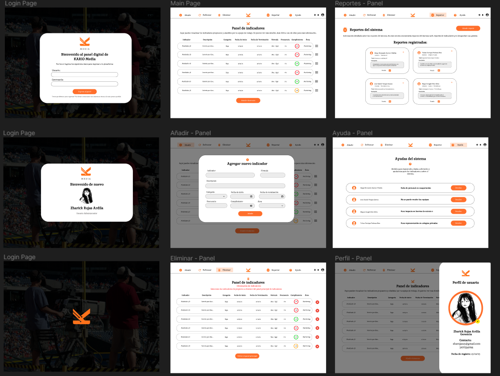
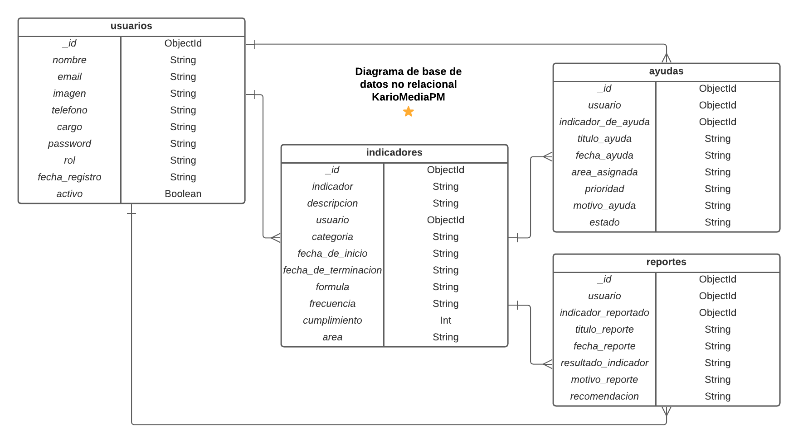

# Proyecto de Desarrollo de Aplicativo Web para Gestión de Proyectos - Kario Media PM - Grupo #4 🎧

*Developers:* 

- Zharick Rojas Ardila
- Diego Fernando Aceros Villalba
- Yohan Enrique Pedraza Rios

Este proyecto busca el desarrollo de un Aplicativo Web que tiene como objetivo proporcionar a la empresa "Kario Media" una plataforma eficiente para la gestión de proyectos en el ámbito de licitaciones públicas y privadas. La empresa se dedica a diversos nichos de negocio y requiere una solución completa para administrar sus proyectos de manera efectiva. ⭐

> El objetivo principal de este proyecto es replicar la propuesta de diseño proporcionada por el equipo de UI/UX y desarrollar los módulos clave que son esenciales para la gestión de proyectos. Estos módulos incluyen:

1. **Añadir:** Permitirá a los usuarios agregar nuevos proyectos y módulos de manera sencilla y eficiente.
2. **Eliminar:** Facilitará la eliminación de proyectos o módulos que ya no sean necesarios.
3. **Reportar:** Ofrecerá la funcionalidad de generar informes y estadísticas relevantes para la toma de decisiones o problemas con el aplicativo web.
4. **Ayuda:** Proporcionará recursos y asistencia para los usuarios que requieran ayuda o soporte.
5. **Perfil (Log-in y Log-out):** Gestionará la autenticación y el acceso de los usuarios a sus perfiles, permitiendo el inicio de sesión seguro y la finalización de la sesión cuando sea necesario.

El objetivo final es crear una aplicación web robusta y fácil de usar que permita a *Kario Media* gestionar eficazmente sus proyectos y mejorar la eficiencia en sus licitaciones públicas y privadas.

## Índice 📑

- [Wireframe diseñado con Figma](#wireframe-diseñado-con-figma)

- [Diagrama de base de datos no relacional](#diagrama-de-base-de-datos-no-relacional)

- [Documentacion backend](#documentacion-backend)

- [¿Cómo utilizar el software?](#cómo-utilizar-el-software)

- [Más información](#más-info)
  - [Tecnologías utilizadas](#tecnologías-utilizadas)
  - [Depencias](#dependencias)
  - [Contribuciones y licencia](#contribuciones-y-licencia)

## Wireframe diseñado con Figma 📍

Para mayor entendimiento del usuario, se construyó un wireframe a nivel UI/UX para conocer la interfaz de usuario a trabajar para construir el aplicativo web de Kario Media, en el siguiente link encontrará una mayor información del sistema especificado:

- [Link de wireframe base con Figma](https://www.figma.com/file/L3fPuJ2nWBYvKeLakZ38Es/Untitled?type=design&node-id=0%3A1&mode=design&t=YCgLbMtvWC3LYoMu-1)

- Imagen de referencia:

<div>
    
<div>

## Diagrama de base de datos no relacional 🔰

Se construyó un modelo de diagrama de base de datos no relacional como la estructura trabajado en MongoDB, presentado a continuación:

<div>
    
<div>

## Documentación backend

Se construyó una documentación con Swagger para los endpoints crud api, presentado a continuación:
- [Documentacion Swagger](http://localhost:8020/api-doc/#/)
-> Funcionará siempre y cuando ya hayas comenzado los servidores back-end y front-end

## ¿Cómo utilizar el software? 💻

Para poder usar este sistema en tu computador, tendrás que instalarlo y utilizarlo localmente, y necesitarás tener instalados los siguientes requisitos:


<div align="center"> Node.js 🚀 </div>
<br>


Para poder instalarlo, sigue los siguientes pasos:

1. Clona el repositorio: `https://github.com/Zachlesk/Kario-Media-PROYECTO-FILTRO.git`
`

## Primer procedimiento 

2. Entrar a la carpeta 'frontend' e inicializa el host con React

    ```bash
    cd frontend
    ```

3. Desde la terminal e instala las dependencias con el siguiente comando:

    ```bash
    npm install
    ```

4. Una vez instaladas las dependencias vamos a abrir una nueva terminal y ejecutamos el software:

    ```bash
    npm start
    ```
<br>
-> ¡Listo! Tu servidor para front-end está en funcionamiento.

<hr>

## Segundo procedimiento

1. Entrar a la carpeta 'backend' e inicializa el servidor Node.js para el api

    ```bash
    cd backend
    ```

2. Desde la terminal e instala las dependencias con el siguiente comando:

    ```bash
    npm install
    ```

3. Una vez instaladas las dependencias vamos a abrir una nueva terminal y ejecutamos el software:

    ```bash
    npm run dev
    ```

4. En la consola, visualizarás el siguiente mensaje: 
    ```bash
    Server is running on port ${PORT}
    ```
<br>
-> ¡Listo! Tu servidor para back-end está en funcionamiento.

<hr>

## Más información ⬇️

### Tecnologías Utilizadas 👨‍💻

- Node.js
- Expres.js
- MongoDB
- React


### Dependencias 🚨


- [cors](https://www.npmjs.com/package/cors) : Esta biblioteca permite configurar fácilmente las políticas de Cross-Origin Resource Sharing (CORS). Controla las solicitudes HTTP entre diferentes dominios.
- [jsonwebtoken](https://www.npmjs.com/package/cors) : Permite generar y verificar JSON Web Tokens (JWT). Los JWT son una forma segura y compacta de representar información entre dos partes.
- [dotenv](https://www.npmjs.com/package/dotenv) : Biblioteca para cargar variables de entorno desde un archivo `.env` en el entorno de Node.js
- [express](https://expressjs.com/) : Un marco de aplicación web minimalista y flexible para Node.js que facilita la creación de aplicaciones web y APIs.
- [mongodb](https://www.npmjs.com/package/mongodb) : El controlador oficial de MongoDB para Node.js, que permite interactuar con bases de datos MongoDB
- [nodemon](https://www.npmjs.com/package/nodemon) : Una herramienta que monitoriza cambios en archivos y automáticamente  reinicia la aplicación Node.js para un flujo de desarrollo más eficiente


<br>

<hr>

### Contribuciones y licencia 👤

¡Agradecemos tus contribuciones al proyecto! Si deseas colaborar, sigue los siguientes pasos:

1. Crea un nuevo "branch" para tus cambios.

   ```shell
   git checkout -b tus-cambios 
   ```

2. Realiza tus modificaciones y mejoras.

3. Haz un "commit" de tus cambios.

   ```shell
   git commit -m "Especificaciones generales de cambios y/o novedades"      
   ```

4. Envía tus cambios al repositorio remoto.

   ```shell
   git push origin tus-cambios 
   ```

4. Abre un "**pull request**" en GitHub para que revisemos tus cambios.


¡Gracias por contribuir al proyecto 'KarioMedia'! 